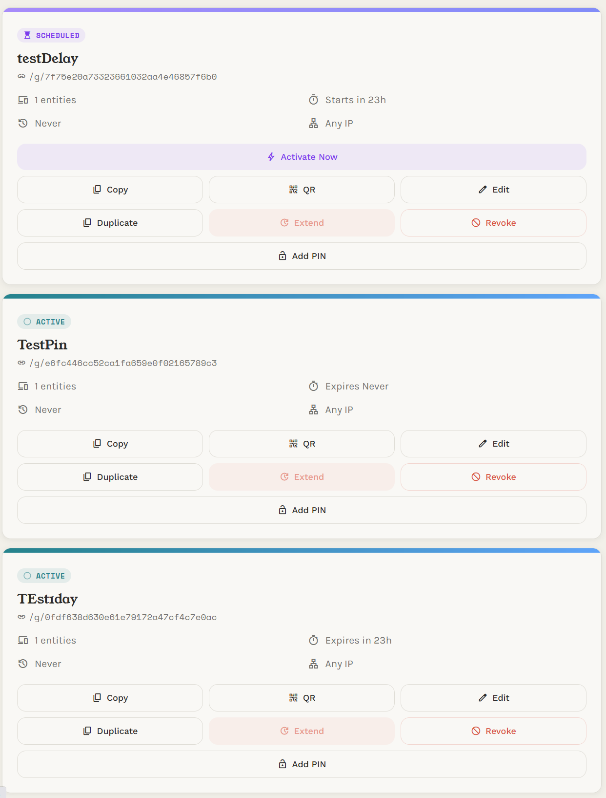

# HAPass

[](LICENSE)

**Shareable guest links for controlling Home Assistant devices**

Create time-limited links that give guests control of specific Home Assistant
entities — lights, locks, thermostats, fans, and more. Guests get a
mobile-friendly PWA with real-time state updates. No HA accounts needed, no app
installs, just a link.

## Screenshots

<p align="center">
  
  
  
  
</p>

## Features

- **Scoped guest tokens** — each token grants access to a specific set of entities
- **Time-limited access** — tokens auto-expire after a configurable duration
- **Real-time updates** — SSE-powered live state changes with automatic reconnect
- **Installable PWA** — guests can add it to their home screen for an app-like experience
- **Dark mode** — system-aware with manual override
- **Admin dashboard** — create, revoke, extend, and monitor tokens
- **Recent activity** — see guest link opens and commands in the admin dashboard
- **Service allowlist** — only safe services (toggle, set_temperature, etc.) are permitted
- **Rate limiting** — 30 req/min per token
- **IP allowlisting** — optionally restrict tokens to specific CIDRs

## Installation

### Home Assistant Add-on (recommended)

1. Add this repository in **Settings → Add-ons → Add-on Store → ⋮ → Repositories**:

   ```
   https://github.com/rohithkadaveru/ha-pass
   ```

2. Find **HAPass** in the store and click **Install**.
3. Go to the **Configuration** tab and set your options.
4. Start the add-on.
5. Click **Open Web UI** or find HAPass in the HA sidebar.

Admin access works through the HA sidebar — no separate login needed. Guest
links use the direct port (`http://<your-ha-ip>:5880/g/{slug}`) so visitors
don't need HA accounts.

### Docker Compose

```yaml
services:
  ha-pass:
    image: ghcr.io/rohithkadaveru/ha-pass:latest
    restart: unless-stopped
    ports:
      - 5880:5880
    volumes:
      - ./data:/data
    environment:
      - ADMIN_USERNAME=admin
      - ADMIN_PASSWORD=changeme
      - HA_BASE_URL=http://homeassistant.local:8123
      - HA_TOKEN=your_long_lived_token_here
```

```bash
docker compose up -d
```

### Docker Run

```bash
docker run -d --restart unless-stopped \
  -p 5880:5880 \
  -v ./data:/data \
  -e ADMIN_USERNAME=admin \
  -e ADMIN_PASSWORD=changeme \
  -e HA_BASE_URL=http://homeassistant.local:8123 \
  -e HA_TOKEN=your_long_lived_token_here \
  ghcr.io/rohithkadaveru/ha-pass:latest
```

The admin dashboard is at `http://localhost:5880/admin/dashboard`.

> **Note:** Docker deployments need a [long-lived access token](https://developers.home-assistant.io/docs/auth_api/#long-lived-access-token) from Home Assistant. Create one in your HA profile under **Security → Long-Lived Access Tokens**. The add-on handles this automatically.

## Configuration

### Add-on Options

Set these in **Settings → Add-ons → HAPass → Configuration**:

| Option | Description | Default |
|---|---|---|
| **Admin Username** | Username for direct-port admin access (not needed for sidebar) | — |
| **Admin Password** | Password for direct-port admin access (min 8 chars) | — |
| **App Name** | Display name shown to guests | `Home Access` |
| **Contact Message** | Message shown when a guest link expires | `Please request a new link...` |
| **Background Color** | Hex color for page background | `#F2F0E9` |
| **Primary Color** | Hex color for accents and buttons | `#D9523C` |
| **Guest URL** | External base URL for guest links (e.g. `https://guest.myhouse.com`) | — |

### Docker Environment Variables

| Variable | Description | Required | Default |
|---|---|---|---|
| `ADMIN_USERNAME` | Admin login username | Yes | — |
| `ADMIN_PASSWORD` | Admin login password (min 8 chars) | Yes | — |
| `HA_BASE_URL` | Home Assistant base URL | Yes | — |
| `HA_TOKEN` | HA long-lived access token | Yes | — |
| `DB_PATH` | SQLite database path | No | `/data/db.sqlite` |
| `APP_NAME` | Display name shown to guests | No | `Home Access` |
| `CONTACT_MESSAGE` | Message shown on expired pages | No | `Please request a new link...` |
| `ACCESS_LOG_RETENTION_DAYS` | Days to retain access logs | No | `90` |
| `BRAND_BG` | Background color (hex) | No | `#F2F0E9` |
| `BRAND_PRIMARY` | Primary/accent color (hex) | No | `#D9523C` |
| `GUEST_URL` | External base URL for guest links | No | — |

## Home Assistant Activity Events

HAPass emits a `ha_pass_activity` event after a valid guest page load and after
a successful guest command. These events are best-effort notification hooks:
HAPass logs and drops event failures without blocking the guest. HAPass also
writes matching Home Assistant Logbook entries for the Activity view.

Event payloads do not include the guest slug, internal token ID, or client IP
address.

```json
{
  "schema_version": 1,
  "activity": "command",
  "token_label": "Cleaner",
  "target_entity_id": "lock.front_door",
  "service": "lock.unlock"
}
```

`activity` is either `page_load` or `command`. `page_load` means the guest link
URL was requested; link previews, scanners, stale bookmarks, and refreshes can
also trigger it. Use `command` for higher-signal notifications.

```yaml
alias: HAPass guest activity notification
triggers:
  - trigger: event
    event_type: ha_pass_activity
conditions:
  - condition: template
    value_template: "{{ trigger.event.data.activity == 'command' }}"
actions:
  - action: notify.mobile_app_phone
    data:
      title: "Guest access"
      message: >
        {{ trigger.event.data.token_label }} used
        {{ trigger.event.data.service }}
        on {{ trigger.event.data.target_entity_id }}
```

## Supported Entity Types

### Controllable Domains

| Domain | Allowed Services |
|---|---|
| `light` | `turn_on`, `turn_off`, `toggle` |
| `switch` | `turn_on`, `turn_off`, `toggle` |
| `input_boolean` | `turn_on`, `turn_off`, `toggle` |
| `climate` | `set_temperature`, `set_hvac_mode`, `turn_on`, `turn_off` |
| `lock` | `lock`, `unlock`, `open` |
| `media_player` | `media_play`, `media_pause`, `media_stop`, `volume_set`, `media_play_pause`, `turn_on`, `turn_off` |
| `cover` | `open_cover`, `close_cover`, `stop_cover` |
| `fan` | `turn_on`, `turn_off`, `toggle`, `set_percentage` |

### Read-Only Domains

| Domain | Access |
|---|---|
| `sensor` | Real-time state display only |
| `binary_sensor` | Real-time state display only |

## Architecture

```
Browser (Guest PWA)
    │
    ├── GET  /g/{slug}          → PWA shell (HTML)
    ├── GET  /g/{slug}/state    → initial entity states
    ├── GET  /g/{slug}/stream   → SSE real-time updates
    └── POST /g/{slug}/command  → service call proxy
                                      │
                                      ▼
                                  HAPass
                                  (FastAPI)
                                      │
                                      ├── REST API → Home Assistant
                                      └── WebSocket → HA event bus
```

## Disclaimer

HAPass is not affiliated with, endorsed by, or associated with Home Assistant
or Nabu Casa Inc. "Home Assistant" is a trademark of Nabu Casa Inc.

## License

[MIT](LICENSE)
